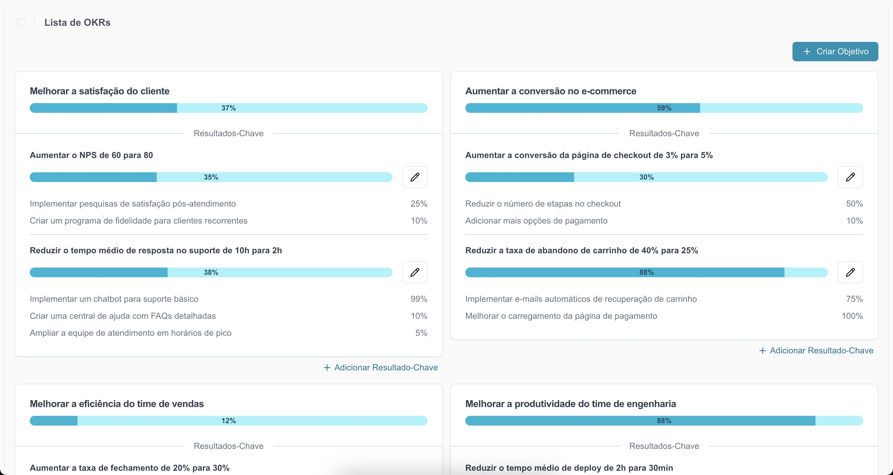
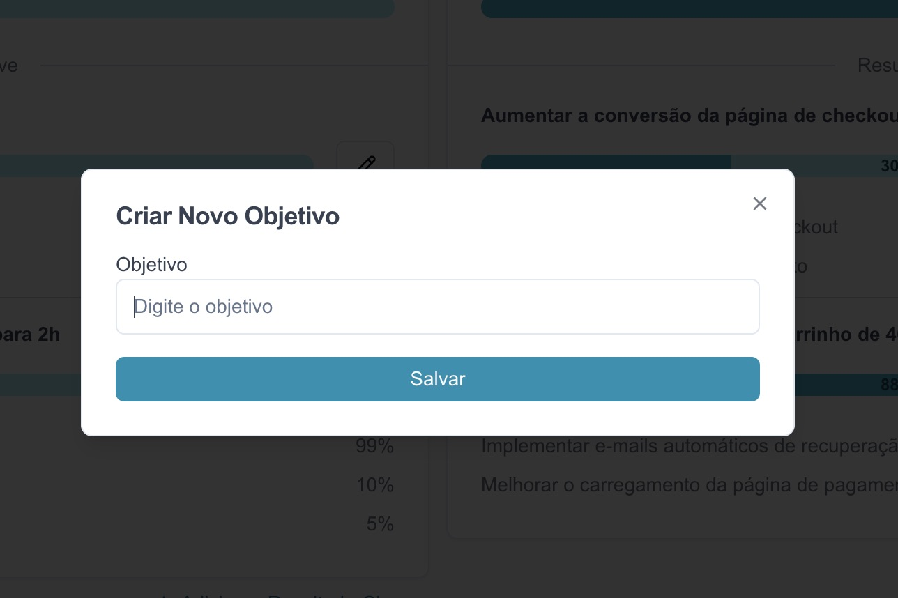
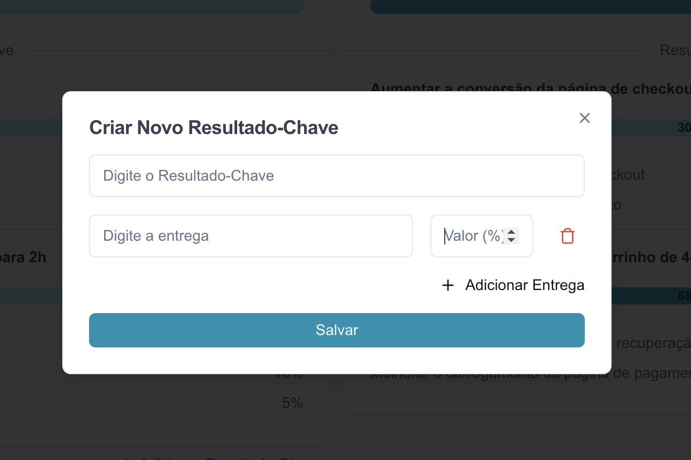
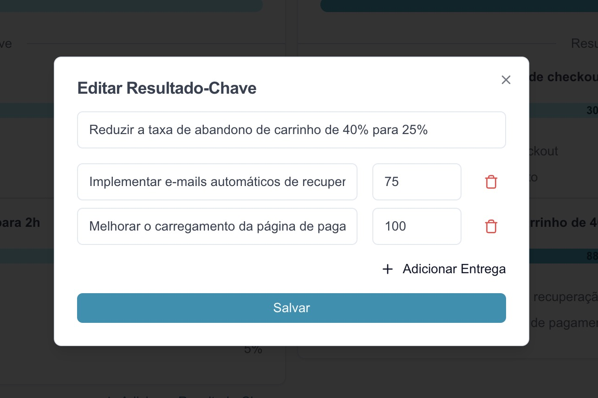

# Teste Técnico para Pessoa Desenvolvedora Frontend na [TTZ.](https://ttz.dev.br)

_Dá uma lida com calma em cada parágrafo, **todos** são importantes._

Este é um teste técnico para a vaga de Pessoa Desenvolvedora Frontend. Você deve ter recebido esse link após ter sido aprovado nas etapas iniciais do nosso processo seletivo. Se chegou aqui por acaso, sinta-se à vontade para realizar o teste e nos enviar o resultado, ficamos feliz com o seu interesse em fazer parte do nosso time.

A [**TTZ.**](https://ttz.dev.br) é uma fábrica de software especializada no desenvolvimento e manutenção de produtos digitais de várias áreas. Nos tornamos a equipe de tecnologia dos projetos dos nossos clientes, e sendo assim, nosso dia a dia envolve a resolução de problemas e implementação de novas funcionalidades trazidas por eles. Além disso, nossa equipe de desenvolvimento também é responsável por manter dois produtos "da casa".

## O problema que você precisa resolver

Um de nossos clientes, a América Senior, nos pediu para desenvolver um painel onde eles pudessem gerenciar os **OKRs** do seu negócio.

**OKRs** (_Objectives and Key Results_) são uma metodologia de definição de metas usada por empresas para alinhar esforços e medir resultados.

- **Objetivos**: Definem uma meta clara e inspiradora que se deseja alcançar. Devem ser desafiadores e qualitativos.
- **Resultados-chave**: São métricas que indicam se o objetivo está sendo atingido. Devem ser específicos, mensuráveis e baseados em evidências.
- **Entregas/Iniciativas**: São as ações concretas que realizamos para influenciar os resultados-chave.

Essa abordagem ajuda a manter equipes focadas, garantindo transparência e acompanhamento contínuo do progresso.

Nesse painel o usuário deve ver os Objetivos cadastrados para o seu negócio, assim como poder cadastrar um novo Objetivo com nome. Para cada Objetivo cadastrado o usuário deve poder cadastrar Resultados-chave com nome e Entregas (cada uma delas deve ter nome e percentual de conclusão).

Com essa descrição nosso novo designer de interfaces construiu alguns prototipos desse painel que podem servir como base para você. Mas fique à vontade para construir uma interface diferente se achar que deve.

A forma como você lida com a experiência do usuário também é um ponto de avaliação neste teste. Sinta-se à vontade para utilizar um _framework_ como [TailwindCSS](https://tailwindcss.com/), [Bootstrap](https://getbootstrap.com/) ou outro. Reinventar a roda não é o caminho.

### Painel



### Card Objetivo


### Modal Adicionar Objetivo



### Modal Adicionar Resultado-Chave



### Modal Editar Resultado-Chave



## API

Para salvar as informações geradas pela interface do teste será necessário integra-se com uma API Rest. 

Você pode usar qualquer API, desde que nos envie as credenciais necessárias para acessá-la e rodar o projeto com sucesso.

Todavia, separamos um serviço público que poderá te ajudar a criar uma API Rest gratuitamente e servirá bem ao propósito deste teste.

O serviço é o [MockAPI.io](https://mockapi.io/) e é possível entender sobre o seu funcionamento acessando sua [Wiki](https://github.com/mockapi-io/docs/wiki).

Após a leitura, utilize o [Gist](https://gist.github.com/wendellpbarreto/ac1620f0345fb07a34b6731eecccc96d) como referência de organização de dados e escolha uma das 3 (três) formas abaixo para seguir:

### 1. Clonar API de OKRs no MockAPI.io (recomendado)

Ao acessar o link https://mockapi.io/clone/67a67e77510789ef0dfb8c45, é possível fazer uma cópia da estrutura da API Rest criada por nós e começar a desenvolver com base nela.

### 2. Criar a Própria API Rest

No [MockAPI.io](https://mockapi.io/), é possível criar sua própria API Rest, modelando os recursos para sua aplicação. 

Só muita atenção ao limite de recursos na conta gratuita que é de 2 (dois) recursos e 1 (um) projeto.


### 3. Utilizar a API Rest Criada por Nós

Nós criamos o modelo para ser clonado e ele está público, então pode ser utilizado caso desejem. 

O único ponto de atenção é que os recursos estarão sendo compartilhados e pode haver edição/exclusão de cadastro entre os participantes do teste.

Os endpoints base são:

```http
  https://67a67e77510789ef0dfb8c44.mockapi.io/api/okrs

  https://67a67e77510789ef0dfb8c44.mockapi.io/api/okrs/${id}/resultKeys
```

## Como você deve entregar seu teste

Nos envie um e-mail para frontend@tootz.com.br contendo:

- Seu nome
- URL do repositório público
- Obrservações e comentários que julgar relevante sobre o seu código

> **"Mas eu estou trabalhando atualmente e não posso publicar esse repositório no meu perfil público"**

A forma como você escreve e organiza os seus _commits_ também é avaliada no teste, mas se realmente é um impedimento para você nos envie o seu código fonte compactado sem a pasta _node_modules_.

## O que esperamos do seu teste

Entendemos que você pode ter experiência com outros _frameworks_ e linguagens, inclusive valorizamos isso. Mas neste teste esperamos que você desenvolva uma aplicação web Javascript utilizando [React](https://react.dev/) e [Next.js](https://nextjs.org/) que são as bases da nossa _stack_.

Dizer que sabe o que é um _state_ ou um _hook_ é fácil, basta ler na documentação. O que vamos avaliar aqui é como você utiliza essas e outras ferramentas desses _frameworks_ para resolver o problema que o cliente pediu.

Sua aplicação **precisa** ser responsiva! É 2025 e não há mais espaço para aplicações web que não funcionam bem em dispositivos móveis.

A forma como você organiza seus arquivos, estrutura seus métodos, nomeia variáveis e gerencia seu código como um todo também será avaliada. Portanto, seja cuidadoso e adote boas práticas e padrões.

Siga as boas práticas do React e do Next.js, além de manter a qualidade do código seguindo as boas práticas do JavaScript. O uso de um linter pode ajudar nesse processo.

Precisamos saber como rodar seu projeto, por isso, garanta que o conteúdo do README seja suficiente para nos guiar neste momento.

**Leia o teste inteiro, pelo menos 3 vezes até o final, e adicione "NANDATÊ" no final do seu e-mail de entrega.**

## O que vai nos impressionar no seu teste

Se encontrarmos testes unitários e/ou de aceitação com certeza você vai ganhar uns pontinhos a mais na seleção.

Além da url do repositório, entregar também a url da aplicação em algum serviço como [Vercel](https://vercel.com), [Netlify](https://www.netlify.com/) ou outro seria algo bem legal de ver.

Os usuários adoram páginas com animações, a gente também. Mas tenha cuidado, se isso comprometer a performance da sua aplicação pode se tornar um ponto negativo.

---

Vamos revisar seu código, testar e avaliar o resultado. Aproveite o tempo indicado para fazer o teste e mostre suas habilidades!

Se tiver alguma dúvida não se acanhe e envie um e-mail para frontend@tootz.com.br.
